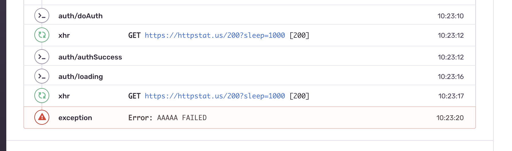

# react-native-template

[](https://travis-ci.com/osamaq/react-native-template)
[](https://www.npmjs.com/package/@osamaq/react-native-template)
[](https://www.npmjs.com/package/@osamaq/react-native-template)

<p align="center" >
  
  
</p>

<br/>

A minimal template with architecture and boilerplate to let you focus on writing features right away.

## Preconfigured with

- TypeScript
- [SWR](https://swr.now.sh/) for data fetching/caching.
- [apisauce](https://github.com/infinitered/apisauce) as data fetcher.
- [Redux Toolkit](https://redux-toolkit.js.org/) for global state.
- [Redux Observable](https://redux-observable.js.org/) for complex background thread-like work.
- [React Navigation](https://reactnavigation.org/) (**v5**) for navigation.
- [Reactotron in Flipper](https://shift.infinite.red/better-react-native-debugging-with-reactotron-in-flipper-6b823af29220) integration for debugging.
- [Sentry](https://docs.sentry.io/platforms/react-native/) for debugging in production.
- [react-native-bootsplash](https://github.com/zoontek/react-native-bootsplash) because splash screens are cool.
- [react-native-svg](https://github.com/react-native-community/react-native-svg) because svg.
- [react-native-config](https://github.com/luggit/react-native-config) to manage separate environments (dev, staging, production).
- [Reanimated](https://software-mansion.github.io/react-native-reanimated/) for animations.
- [Redash](https://wcandillon.github.io/react-native-redash/) its lodash for animations.
- [AsyncStorage](https://github.com/react-native-community/async-storage) you're gonna install it anyway.
- [FastImage](https://github.com/DylanVann/react-native-fast-image) its more performant
- [Detox](https://github.com/wix/Detox) for e2e.
- [Mirage JS](https://miragejs.com/) the easiest way to mock APIs.
- [Fastlane](http://fastlane.tools/) for automation.
- handy npm scripts.

## Getting Started

Create a new project using the template.

- **Note:** the command will fail if you have the global legacy react-native-cli installed. Make sure you uninstall it first. More info at [react-native-community/cli](https://github.com/react-native-community/cli#about).

### RN 0.63.2

```bash
$ npx react-native init MyApp --template @osamaq/react-native-template
```

## Optional Steps

#### Connect To Sentry

This template comes with Sentry, but its disabled until you connect your account. It also comes with a [custom middleware](https://github.com/osamaq/react-native-template/blob/master/template/src/redux/middleware/sentryMiddleware.ts) for Redux. What the middleware does is add your redux action types as breadcrumbs to Sentry's crash logs for easier debugging. It does not log payloads, which you might wish do if your app's networking activity is lightweight.

<div align="center">
    
</div>

To connect your account:

```bash
$ cd MyApp/

# For MacOS
$ npx sentry-wizard -i reactNative -p ios android

# Other Platforms
$ npx sentry-wizard -i reactNative -p android
```

Insert your sentry DSN in each [.env](https://github.com/osamaq/react-native-template/blob/ed37c213eacf0681c4f50f959bad170d46be0ed7/template/.env.prod#L5) file (dev, staging and production) and you're all done.

## Credits

This template is modified from [react-native-typescript-template](https://github.com/react-native-community/react-native-template-typescript). Thank you ❤️
