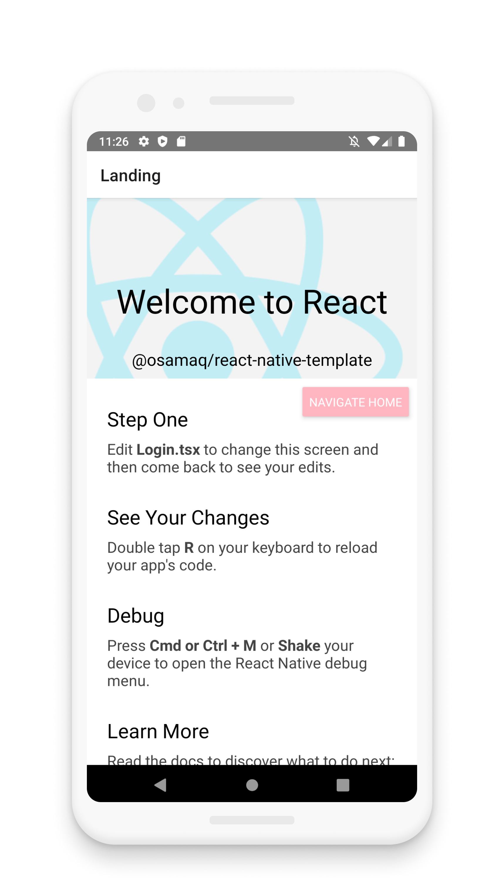
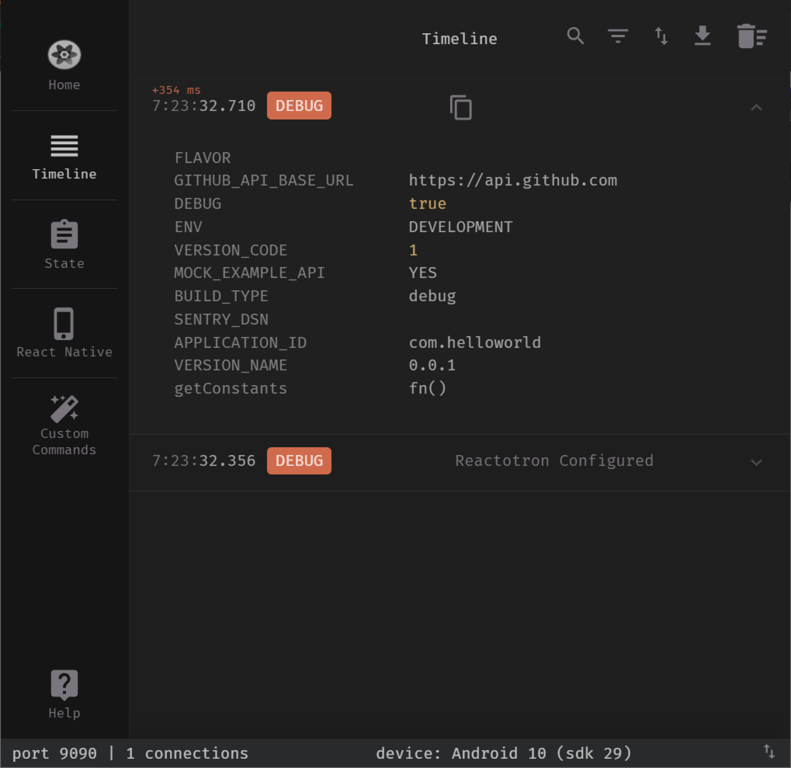
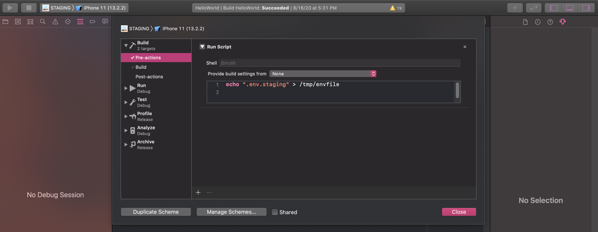

# react-native-template

[](https://travis-ci.com/osamaq/react-native-template)
[](https://www.npmjs.com/package/@osamaq/react-native-template)
[](https://www.npmjs.com/package/@osamaq/react-native-template)

<p align="center" >
  
  
</p>

<br/>

A minimal template with architecture and boilerplate to let you focus on writing features right away.

Preconfigured with

- TypeScript
- [SWR](https://swr.now.sh/) for data fetching/caching.
- [apisauce](https://github.com/infinitered/apisauce) as data fetcher.
- [Redux Toolkit](https://redux-toolkit.js.org/) for global state.
- [Redux Observable](https://redux-observable.js.org/) for complex background thread-like work.
- [React Navigation](https://reactnavigation.org/) (**v5**) for navigation.
- [Reactotron in Flipper](https://shift.infinite.red/better-react-native-debugging-with-reactotron-in-flipper-6b823af29220) integration for debugging.
- [Sentry](https://github.com/getsentry/sentry-react-native) for debugging in production.
- [react-native-bootsplash](https://github.com/zoontek/react-native-bootsplash) because splash screens are cool.
- [react-native-svg](https://github.com/react-native-community/react-native-svg) because svg.
- [react-native-config](https://github.com/luggit/react-native-config) to manage separate environments (dev, staging, production).
- [Reanimated](https://software-mansion.github.io/react-native-reanimated/) for animations.
- [Redash](https://wcandillon.github.io/react-native-redash/) its lodash for animations.
- [AsyncStorage](https://github.com/react-native-community/async-storage) you're gonna install it anyway.
- [FastImage](https://github.com/DylanVann/react-native-fast-image) its more performant
- [Detox](https://github.com/wix/Detox) for e2e.
- [Mirage JS](https://miragejs.com/) the easiest way to mock APIs.
- [Fastlane](http://fastlane.tools/) for automation.
- handy npm scripts.

## Contents

- [Documentation](#documentation)
- [Getting Started](#getting-started)
- [Optional Steps](#optional-steps)
- [Credits](#credits)

## Documentation

- [Libraries](#libraries)
- [Directory Structure](#directory-structure)
- [Quick Overview](#quick-overview)
- [File Walkthrough](./docs/file-walkthrough.md)

## Getting Started

Create a new project using the template.

- **Note:** the command will fail if you have the global legacy react-native-cli installed. Make sure you uninstall it first. More info at [react-native-community/cli](https://github.com/react-native-community/cli#about).

### RN 0.63.2

```bash
$ npx react-native init MyApp --template @osamaq/react-native-template
```

## Optional Steps

#### Connect To Sentry

This template comes with [Sentry](https://github.com/getsentry/sentry-react-native), but its disabled until you connect your account.

To connect your account:

```bash
$ cd MyApp/

# For MacOS
$ npx sentry-wizard -i reactNative -p ios android

# Other Platforms
$ npx sentry-wizard -i reactNative -p android
```

Insert your sentry DSN in each [.env](https://github.com/osamaq/react-native-template/blob/ed37c213eacf0681c4f50f959bad170d46be0ed7/template/.env.prod#L5) file (dev, staging and production) and you're all done.

#### Install Reactotron Flipper Plugin

This allows you to use Reactotron within Flipper.

Flipper -> Manage Plugins -> Install Plugins -> flipper-plugin-reactotron

## Libraries

Let's briefly go over the benefit of each library included in this template.

### TypeScript

For type safety ¯\\_(ツ)_/¯

But in all seriousness, if you are considering this template I assume you are a TypeScript fan. If you happen to be a JavaScript user, this template might be overwhelming. If you would like to start learning TypeScript, I suggest bootstrapping with this instead [react-native-community/react-native-template-typescript](https://github.com/react-native-community/react-native-template-typescript) so you can learn at your own pace.

### SWR

This library simplifies data fetching and cache management. It allows you to easily show cached data, while the new data is being loaded from the API.

- Caveat: currently it only supports in-memory caching for data.

- Alternative: React Query/Apollo.

### apisauce

Its a wrapper around axios with extended functionality. I'm happy with its API and I like the problem matcher.

### Redux/Redux Toolkit

I'm happy using Redux Toolkit. It's a lot more concise now and I enjoy the redux ecosystem of plugins.

SWR reduces our dependency on Redux for global state. And sometimes React Navigation can be used to send data to the next screen. I try to leverage these two before reaching out to global state.

If you prefer something else, remove redux and go with that. Do not waste time trying a new state management solution.

### Redux Observable

This is used alongside Redux for complex background work. Most people will rarely need to use something like this. In fact, if you aren't sure, just remove it (also uninstall its dependency, rxjs).

### React Navigation

It is the most popular navigation library. For most apps, this is the best choice.

### Reactotron/Flipper

Using this template there will be two main deubgging tools in your toolbelt. Reactotron and Flipper.

I mainly use Reactotron for reading API calls, asyncstorage operations, redux actions etc. It organizes everything in a neat way. It also has a killer image overlay feature, which allows you to get the UI design pixel prefect.

Flipper could be used for lower level debugging, such as viewing your database or React component tree. There is also a Flipper plugin for using Reactotron within it, so you only need to start one application.

> Flipper -> Manage Plugins -> Install Plugins -> flipper-plugin-reactotron

### Sentry

Benefitial in debugging issues that occur only in release builds. You can view error stack traces for unhandled exceptions. You can also choose to log specific errors in some catch blocks to study how often they occur in production.

In this template, there is a custom Redux [middleware](https://github.com/osamaq/react-native-template/blob/master/template/src/redux/middleware/sentryMiddleware.ts) that adds Redux actions as breadcrumbs to Sentry reports for even easier debugging.

This is similar to [redux-sentry-middleware](https://github.com/vidit-sh/redux-sentry-middleware) but I've yet to test that one.

### react-native-bootsplash

Works great for controlling your splash screen.

### react-native-svg

Prefer using SVG over images all the time (remember to optimize your SVGs).

### react-native-config

If you have different development, staging and production variables, this library is very helpful. It allows you to declare environment variables that can be accessed by all 3 sides (android, ios, JavaScript).

Android: by default, running `react-native run-android` will use the development .env file. To load .env.staging we must use:

`ENVFILE=.env.staging react-native run-android`

> Note: the above works on MacOS. For windows its a bit different. See [Different Environments](https://github.com/luggit/react-native-config#different-environments).

iOS: two additional schemes are created in the Xcode project for staging and production. The corresponding .env file is set via the scheme's pre-action:

<div align="center">
    
</div>

NPM scripts for running the app with the desired configuration are [included](https://github.com/osamaq/react-native-template/blob/acc4f4ab117bee099a531ad44be1130f9d24df69/template/package.json#L11) for convenience.

### Reanimated/Redash

Necessary when creating complex gesture based animations that are highly performant. Redash contains boilerplate helpers for Reanimated.

### AsyncStorage

For caching simple data such as user perferences.

### FastImage

Drop in replacement for the `<Image/>` component. I've found this to give a performance boost on android when rendering many images.

### Detox

For end-to-end testing.

### Mirage JS

Mirage is an in-memory server for intercepting API calls and returning whatever data you want. Very useful for developing before the backend is deployed, and for confirming how the app reacts to different API call outcomes.

### Fastlane

Fastlane community has an endless amount of mobile development automation plugins. I currently use it mainly for [automatic versioning](https://osamaq.com/automatic-versioning-for-react-native-apps/), and often for deploying to Microsoft's App Center in [one command](https://github.com/osamaq/reactnative-fastlane-appcenter).

This template also has a [fastlane command](https://github.com/osamaq/react-native-template/blob/acc4f4ab117bee099a531ad44be1130f9d24df69/template/fastlane/Fastfile#L203) for adding version badges to app icons. Useful outside of production as it makes it easier for QA to tell the app version.

<div align="center">
    
</div>

---

> _If you appreciate those libraries and find them useful, please consider supporting them._

## Directory Structure

```
root
├── __tests__
├── android
├── e2e
├── fastlane
├── ios
├── scripts
└── src
    └── common
    |   ├── assets
    |   ├── components
    |   ├── exceptions
    |   ├── helpers
    |   ├── hooks
    |   ├── theme
    |   └── types
    └── features
    |   ├── error-boundary
    |   ├── home
    |   ├── landing
    |   └── navigation
    └── redux
    |   ├── middleware
    |   └── slices
    └── services
        ├── cache
        ├── navigation
        └── network
            ├── github
            └── mock
```

## Quick Overview

Quickly get an idea about each folder's role.

| Directory      | Short Description                                                        |
| :------------- | :----------------------------------------------------------------------- |
| root           | Root directory. Contains many configuration files and all other folders. |
| \_\_tests\_\_  | (Default; as per official template)                                      |
| android        | Android project. Includes modifications to integrate libraries.          |
| e2e            | Detox end-to-end tests and configurations.                               |
| fastlane       | Useful fastlane automation scripts.                                      |
| ios            | iOS project. Includes modifications to integrate libraries.              |
| scripts        | Handy node scripts for code generation.                                  |
| src            | Most of the app's code is here.                                          |
| common         | Shared code between different features.                                  |
| assets         | Shared images, fonts etc.                                                |
| components     | Shared React components.                                                 |
| exceptions     | Shared custom exceptions.                                                |
| helpers        | Shared utlities.                                                         |
| hooks          | Shared hooks.                                                            |
| theme          | Shared styles; app's theme.                                              |
| types          | Shared general types.                                                    |
| features       | Feature directories.                                                     |
| error-boundary | Root error boundary.                                                     |
| home           | Home screen. Has simple data fetching and global state examples.         |
| landing        | Template's initial screen.                                               |
| navigation     | Contains a simple stack navigator.                                       |
| redux          | Redux integration.                                                       |
| middleware     | Redux custom middleware. For now, a simple Sentry breadcrumb logger.     |
| slices         | Redux state slices.                                                      |
| services       | App's services.                                                          |
| cache          | Cache service; AsyncStorage wrapper.                                     |
| navigation     | Navigation service (navigate from outside React components).             |
| network        | Networking related services.                                             |
| github         | Example GitHub API client (REST).                                        |
| mock           | MirageJS in-memory server for mocking backend APIs.                      |

If you would like to learn more without going through the codebase, read the [file walkthrough here](./docs/file-walkthrough.md).

## Credits

This template is modified from [react-native-typescript-template](https://github.com/react-native-community/react-native-template-typescript). Thank you ❤️
