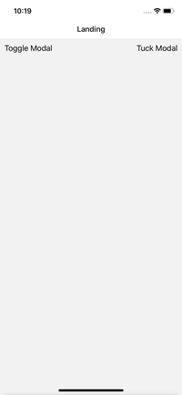
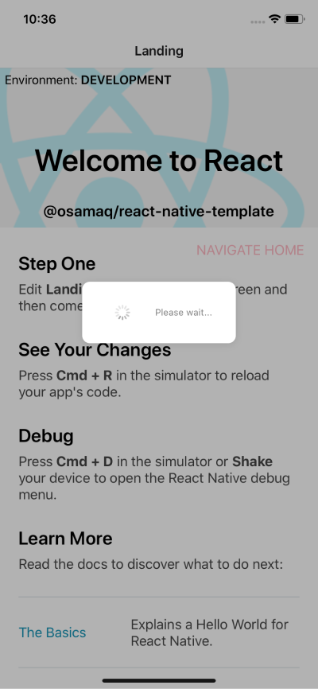
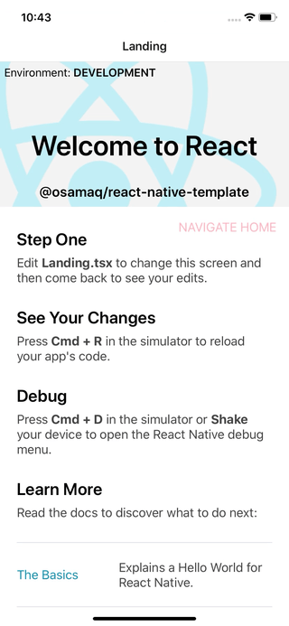
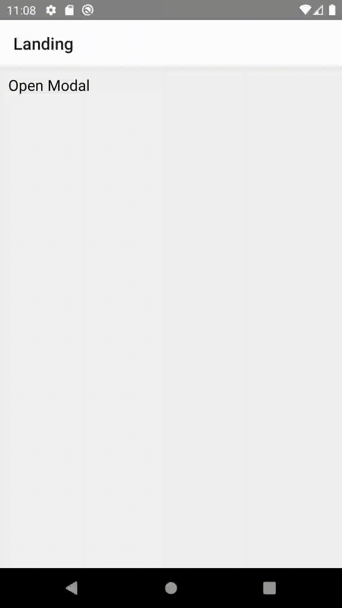

## File Walkthrough

In addition to configuring many libraries, this template also includes some boilerplate files that end up in most apps (e.g. theme). These files/components serve mainly as examples and are meant for you to change and expand upon or remove if unneeded.

### ./ (**root**)

| File                          | Description                                                                                                                                                                                                                                                                                                                                 |
| :---------------------------- | :------------------------------------------------------------------------------------------------------------------------------------------------------------------------------------------------------------------------------------------------------------------------------------------------------------------------------------------ |
| eslintrc.js                   | My preferred eslint confugration. Configured for TypeScript and to ignore rules from prettier.                                                                                                                                                                                                                                              |
| .detoxrc.json                 | Configuration for running detox e2e tests. Please see go through detox documentation to learn how to use it ([Android](https://github.com/wix/Detox/blob/master/./Introduction.Android.md#2-apply-detox-configuration), [iOS](https://github.com/wix/Detox/blob/master/./Introduction.Ios.md#2-apply-detox-configuration)).                 |
| .env, .env.staging, .env.prod | Environment variables used with react-native-config. If you modify these, the app must be rebuilt to reflect changes. Additionally, you can get type autocomplete by generating the types using [this npm script](https://github.com/osamaq/react-native-template/blob/acc4f4ab117bee099a531ad44be1130f9d24df69/template/package.json#L23). |
| jest.config.js, jest.setup.js | Configration for Mirage JS to allow its usage in jest unit tests.                                                                                                                                                                                                                                                                           |
| react-native.config.js        | Extra configuration such that running `react-native-link` will automatically add our custom fonts under `./src/common/assets/fonts` to our native iOS and Android projects making them available for use.                                                                                                                                   |
| reactotron.ts                 | Setup for Reactotron. We also attach it to the globally available console instance in `__DEV__` for convenience.                                                                                                                                                                                                                            |
| tsconfig.json                 | TypeScript configuration.                                                                                                                                                                                                                                                                                                                   |
| Gemfile                       | Main Gemfile. References our list of dependencies (plugins) for our fastlane setup.                                                                                                                                                                                                                                                         |
| App.tsx                       | The root of our app. Contains setup to enable react-native-screens, initialize Sentry, enable LayoutAnimation for Android, instantiate our Mirage JS server. The app component renders our root error boundary, our redux store provider, our portal provider and our root navigator.                                                       |

### ./**\_\_tests\_\_**

(Default contents; as per official template)

### ./**android**

| File                                       | Description                                                                                |
| :----------------------------------------- | :----------------------------------------------------------------------------------------- |
| settings.gradle                            | Increased memory for build process. Added boilerplate release signing config variables. |
| build.gradle                               | Modified for Detox integration.                                                            |
| app/build.gradle                           | Modified for Detox integration. Modified for react-native-config integration.           |
| DetoxTest.java                             | Added for Detox integration.                                                               |
| AndroidManifiest.xml                       | Modified for react-native-bootsplash integration.                                          |
| bootsplash.xml colors.xml styles.xml | Added for react-native-bootsplash integration.                                             |

### ./**e2e**

| File                          | Description                                                      |
| :---------------------------- | :--------------------------------------------------------------- |
| config.json environment.js | Added for Detox integration.                                     |
| firstTest.e2e.js              | Smoke test for template to confirm detox integration is working. |

### ./**fastlane**

| File       | Description                                                                                                                                                                                                                                                                                                                                                                                                                                                                                                                                                                                                          |
| :--------- | :------------------------------------------------------------------------------------------------------------------------------------------------------------------------------------------------------------------------------------------------------------------------------------------------------------------------------------------------------------------------------------------------------------------------------------------------------------------------------------------------------------------------------------------------------------------------------------------------------------------- |
| .env       | Fastlane environment variables.                                                                                                                                                                                                                                                                                                                                                                                                                                                                                                                                                                                      |
| Fastfile   | Fastlane automation configuration.  1- Automated deployment to App Center. 2- Automated versioning and icon badge generation.  If you are not familiar at all with fastlane, I recommend these 2 posts by me:  1- [React Native, fastlane and Visual Studio App Center](https://github.com/osamaq/reactnative-fastlane-appcenter). 2- [Automatic Versioning for React Native Apps](https://osamaq.com/automatic-versioning-for-react-native-apps/).  You can also read through the README.md file generated by fastlane after every run. It contains a list of the available commands. |
| Pluginfile | List of dependencies (plugins) required by our Fastlane setup. Imported by the [main Gemfile](https://github.com/osamaq/react-native-template/blob/master/template/Gemfile).                                                                                                                                                                                                                                                                                                                                                                                                                                         |

### ./**ios**

| File                        | Description                                                                                                                                       |
| --------------------------- | :------------------------------------------------------------------------------------------------------------------------------------------------ |
| AppDelegate.m info.plist | Modified for react-native-bootsplash integration.                                                                                                 |
| BootSplash.storyboard       | Added for react-native-bootsplash integration.                                                                                                    |
| (project schemes)           | Added `STAGING` and `PRODUCTION` schemes and modified the main scheme `${APP_NAME}`. Modified pre-actions for all schemes for react-native-config integration. |

### ./**scripts**

| File           | Description                                                                                                                                                                                                                                                                                                                                                  |
| -------------- | :----------------------------------------------------------------------------------------------------------------------------------------------------------------------------------------------------------------------------------------------------------------------------------------------------------------------------------------------------------- |
| buildConfig.js | Node script to generate TypeScript types for react-native-config based on the contents of our `.env.x` files.  To run it, you can use `generate-build-config`. To learn more, you can read my article: [Generating TypeScript Types for Environment Variables](https://osamaq.com/react-native-generating-typescript-types-for-environment-variables/) |
| images.js      | Node script to generate image imports based on filenames in `src/common/assets/images`.  To run it you can use `generate-image-imports` npm script.                                                                                                                                                                                                    |

### ./src/common/**assets**

| File   | Description                                                                                                                                                                                                                                                                                                                             |
| ------ | :-------------------------------------------------------------------------------------------------------------------------------------------------------------------------------------------------------------------------------------------------------------------------------------------------------------------------------------- |
| fonts  | Example font files. Unlinked by default.  To link and use them in your app, see [linking fonts](https://github.com/osamaq/react-native-template/blob/master/template/src/common/assets/fonts/how-to-add-fonts.md). |
| images | Sample image file and sample `index.js` file generated by `generate-image-imports` npm script.                                                                                                                                                                                                                                          |

### ./src/common/**components**

| File                | Description                        |                                     Preview                                      |
| ------------------- | :--------------------------------- | :------------------------------------------------------------------------------: |
| CardModal.tsx       | Sample modal transition animation. |        |
| LoadingPopup.tsx    | Sample loading pop up.             |  |
| Snackbar.tsx        | Sample snackbar.                   |     |
| abstract/Space.tsx  | Sample spacer.                     |                                        -                                         |
| abstract/Portal.tsx | Sample portal.                     |                                        -                                         |

### ./src/common/**contexts**

| File              | Description                                                       |
| ----------------- | :---------------------------------------------------------------- |
| PortalContext.tsx | Sample portal context and portal provider. Consumed by Portal.tsx |

### ./src/common/**exceptions**

| File                    | Description                                                                                                                      |
| ----------------------- | :------------------------------------------------------------------------------------------------------------------------------- |
| BaseException.ts        | Base error class that extends `Error`.  If thrown, we can match for it using `err instanceof BaseException`.               |
| HttpException.ts        | Sample exception that extends BaseException.  If thrown, we can match for it using `err instanceof HttpException`.         |
| HttpTimeoutException.ts | Sample exception that extends BaseException.   If thrown, we can match for it using `err instanceof HttpTimeoutException`. |

### ./src/common/**helpers**

| File           | Description         |
| -------------- | :------------------ |
| base64Utilt.ts | Base64 helpers.     |
| dateUtil.ts    | Dates helpers.      |
| layoutUtil.ts  | UI helpers.         |
| logUtil.ts     | Logging helpers.    |
| networkUtil.ts | Networking helpers. |

### ./src/common/**hooks**

| File                     | Description                                                                                                                                   |                                                    Preview                                                    |
| :----------------------- | :-------------------------------------------------------------------------------------------------------------------------------------------- | :-----------------------------------------------------------------------------------------------------------: |
| useBackgroundOverlay.tsx | Returns a background overlay component that handles the back button for android and fades in/out.  Useful when composing modals/popups. |  |
|                          |                                                                                                                                               |                                                                                                               |
| useModal.tsx             | Hook for managing modals.                                                                                                                     |                                                                                                               |

### ./src/common/**theme**

| File     | Description                                                                                         |
| -------- | :-------------------------------------------------------------------------------------------------- |
| theme.ts | Sample app theme. Contains theme (common styles) and palette (app colors and fonts to choose from). |

### ./src/common/**types**

| File       | Description                                                                                                                          |
| ---------- | :----------------------------------------------------------------------------------------------------------------------------------- |
| env.d.ts   | Environment variables typings for react-native-config module. This file can be regenerated using `generate-build-config` npm script. |
| types.d.ts | Common types.                                                                                                                        |

### ./src/features/**error-boundary**

| File                 | Description                                        |
| -------------------- | :------------------------------------------------- |
| RootErrorBoundary.ts | Sample error boundary used at the root of the app. |

### ./src/features/**home**

| File     | Description                                                                                                       |
| -------- | :---------------------------------------------------------------------------------------------------------------- |
| Home.tsx | This screen exists to showcase navigation (from Landing.tsx to Home.tsx), data fetching with SWR and redux usage. |

### ./src/features/**landing**

| File        | Description                                                                                               |
| ----------- | :-------------------------------------------------------------------------------------------------------- |
| Landing.tsx | Template landing screen. Slightly modified from the official template. Has a button to go to Landing.tsx. |

### ./src/features/**navigation**

| File          | Description                                                                                     |
| ------------- | :---------------------------------------------------------------------------------------------- |
| Navigator.tsx | Stack navigator example.  react-native-bootsplash is used here to hide the splash screen. |

### ./src/**redux**

| File           | Description                                                                                                                                  |
| -------------- | :------------------------------------------------------------------------------------------------------------------------------------------- |
| middleware     | Middleware to be used with redux. Currently only contains `sentryMiddleware.ts`, a redux actions logger for Sentry.                          |
| slices         | Contains our main redux action logic.  `slices/exampleSlice.ts` contains minimal examples of Redux Toolkit and Redux Observable usage. |
| rootReducer.ts | Our root reducer. You will rarely need to edit this file unless when adding new state slices.                                                |
| store.ts       | Our redux store. You will rarely need to edit this file unless when adding new redux observable epics or modifying the store configuration.  |

### ./src/services/**cache**

| File            | Description                                                |
| --------------- | :--------------------------------------------------------- |
| cacheService.ts | Wrapper around AsyncStorage. Add common interactions here. |

### ./src/services/**navigation**

| File                 | Description                                                                                                          |
| -------------------- | :------------------------------------------------------------------------------------------------------------------- |
| navigationService.ts | Global navigation service. Allows interacting with our navigator from outside React components (e.g. Redux actions). |

### ./src/services/network/**github**

| File             | Description                                      |
| ---------------- | :----------------------------------------------- |
| githubService.ts | Sample apisauce client setup for the GitHub API. |
| models.ts        | Types related to the GitHub API.                 |

### ./src/services/network/**mock**

| File      | Description                                                                                                                      |
| --------- | :------------------------------------------------------------------------------------------------------------------------------- |
| mirage.ts | In memory server for mocking APIs. By default, this server is created in development builds only (not in staging or production). |
